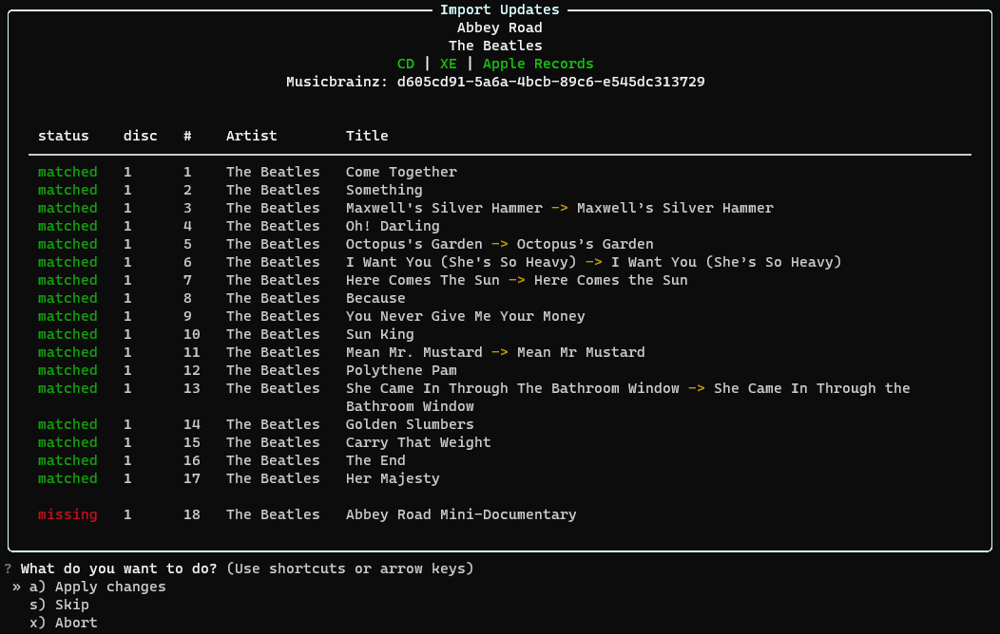

###############
Welcome to Moe!
###############
Moe is our resident Music-Organizer-Extraordinaire who's sole purpose is to give you full control over your music library by streamlining the process between downloading/ripping music to your filesystem and listening to it with your favorite music player.

In short, Moe maintains a database of your music library that can be updated with various metadata sources, queried, edited, etc. through either an API or command-line interface. All of these features, and more, are made available by a highly extensible plugin ecosystem.

Because all of this functionality is available as a python API which doesn't always require a database of music to operate on, Moe also provides an extensive suite of tools for handling and operating on music files. This can greatly simplify or enhance any other script/program that deals with music.

Usage
=====

CLI
---
Moe comes with a command-line interface which is how most users will take advantage of the library management features. Below is a screenshot of Moe importing an album from the filesystem and adding it to the underlying database all while fixing tags, relocating the files, and anything else you can imagine.

Once added to Moe, querying your library or manipulating your music by editing tags, renaming files, etc. is all just a single command away. The ultimate goal is to automate away any tedius and time-consuming steps you have in your workflow without sacrificing the attention to detail. With the help of an *extremely* flexible plugin system, you can easily fine-tune your music library exactly how you like.

Library
-------
As previously mentioned, all of Moe's music management logic and functionality is also available as a python library. As an example, below is a standalone script that takes an album directory and Musicbrainz release ID from the command-line, and then updates the underlying files' tags with any changes from Musicbrainz.

.. code:: python

    #!/usr/bin/env python3

    import argparse
    from pathlib import Path

    from moe.config import Config, ConfigValidationError
    from moe.library import Album
    from moe.write import write_tags
    import moe_musicbrainz

    def main():
        try:
            Config(config_dir=Path.home() / ".config" / "my_script", init_db=False)
        except ConfigValidationError as err:
            raise SystemExit(1) from err

        parser = argparse.ArgumentParser(
            description="Update an album with musicbrainz tags."
        )
        parser.add_argument("path", help="dir of the album to update")
        parser.add_argument("mb_id", help="musicbrainz id of the album to fetch")
        args = parser.parse_args()

        album = Album.from_dir(Path(args.path))

        album.merge(moe_musicbrainz.get_album_by_id(args.mb_id), overwrite=True)

        for track in album.tracks:
            write_tags(track)

    if __name__ == "__main__":
        main()

This is just a small taste of what Moe is capable of and how it can make your life easier when dealing with music.

If you want to learn more, check out the `Getting Started <https://mrmoe.readthedocs.io/en/latest/getting_started.html>`_ docs.
